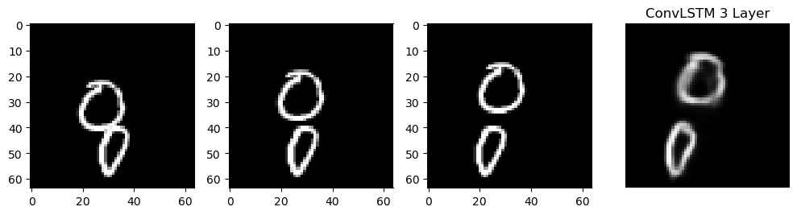
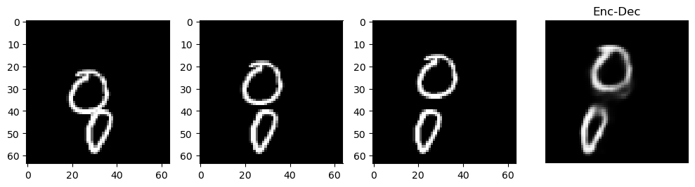
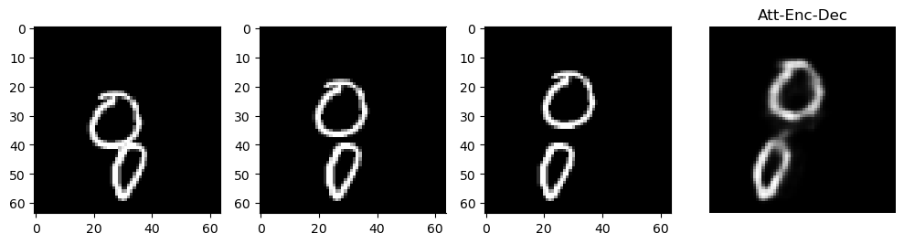
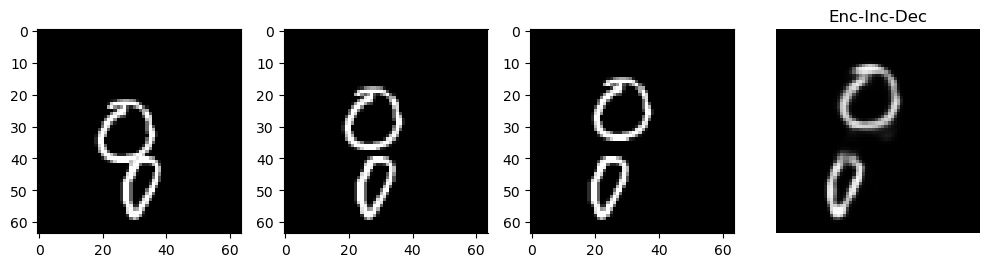
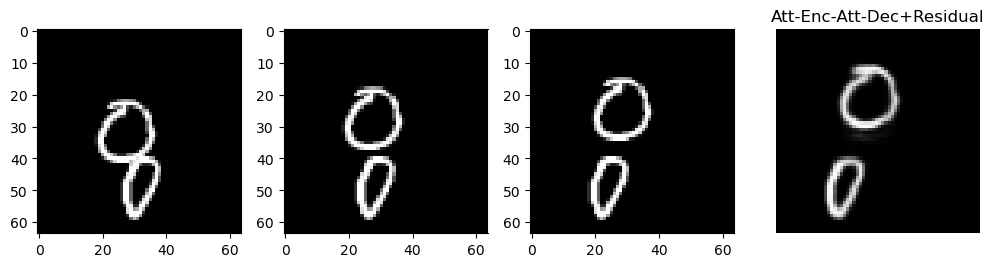

# Moving MNIST in a Notebook
This notebook works on the moving MNIST dataset by trying different architectures.
Differently from the common implementations working on the next frame prediction, all the models are take as input 3 frames (instead of 10) to predict the next one.

All the models' weights can be found in models folder.

These are the predictions for all the trained models, additional informations on the models' structure and the training recipe can be found inside the notebook.

